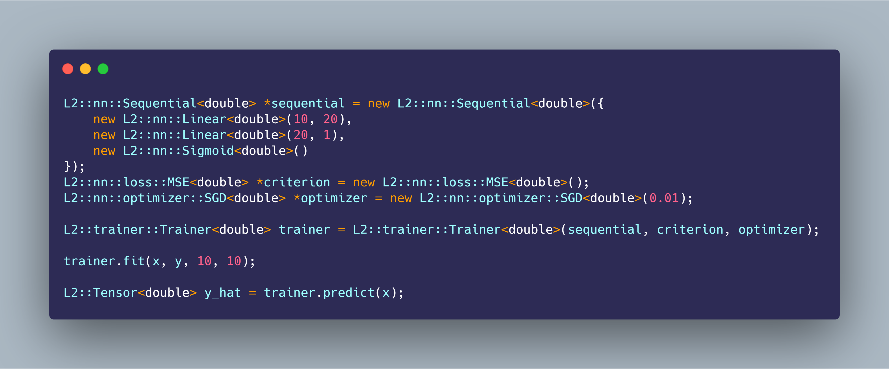

<h1 align='center'>
    L2 • 🤖
</h1>

<h4 align='center'>
    A multidimensional array and deep learning library implemented from scratch in C++
</h4>

<p align='center'>
    <a href="https://www.producthunt.com/posts/l2?utm_source=badge-featured&utm_medium=badge&utm_souce=badge-l2" target="_blank">
    <a href="https://forthebadge.com">
        
    </a>
    <a href="https://github.com/prettier/prettier">
        
    </a>
    <a href="https://opensource.org/licenses/MIT">
        
    </a>
    <a href="http://makeapullrequest.com">
        
    </a>
    <a href="https://github.com/bkkaggle/L2/pulls">
        
    </a>
</p>

<p align='center'>
    <a href='#installation'>Installation</a> •
    <a href='#documentation'>Documentation</a> •
    <a href='#contributing'>Contributing</a> •
    <a href='#authors'>Authors</a> •
    <a href='#license'>License</a> •
    <a href='#acknowledgements'>Acknowledgements</a>
</p>

<div>
    
</div>

<p align='center'><strong>Made by <a href='https://github.com/bkkaggle'>Bilal Khan</a> • https://bilal.software</strong></p>

<!-- START doctoc generated TOC please keep comment here to allow auto update -->
<!-- DON'T EDIT THIS SECTION, INSTEAD RE-RUN doctoc TO UPDATE -->

-   [What is L2?](#what-is-l2)
-   [Quick start](#quick-start)
-   [Design choices](#design-choices)
-   [Documentation](#documentation)
    -   [L2](#l2)
    -   [L2::Tensor\<double>({3, 3})](#l2tensor%5Cdouble3-3)
        -   [Create a tensor](#create-a-tensor)
        -   [Numpy style array slicing](#numpy-style-array-slicing)
        -   [Change dimensions of a Tensor](#change-dimensions-of-a-tensor)
        -   [Get information about a Tensor](#get-information-about-a-tensor)
        -   [Operations on tensors (with broadcasting!)](#operations-on-tensors-with-broadcasting)
        -   [Initialize a tensor](#initialize-a-tensor)
        -   [Linear algebra functions](#linear-algebra-functions)
    -   [L2::Parameter\<double>(tensor)](#l2parameter%5Cdoubletensor)
    -   [nn](#nn)
        -   [Layer<T>](#layert)
        -   [Creating your own layers](#creating-your-own-layers)
        -   [L2::nn::Linear\<double>(c_in=32, c_out=64)](#l2nnlinear%5Cdoublec_in32-c_out64)
        -   [L2::nn::Sigmoid\<double>()](#l2nnsigmoid%5Cdouble)
        -   [L2::nn::Sequential\<double>(layers)](#l2nnsequential%5Cdoublelayers)
    -   [Loss](#loss)
        -   [L2::nn::loss::MSE\<double>()](#l2nnlossmse%5Cdouble)
    -   [Optimizer](#optimizer)
        -   [L2::nn::optimizer::SGD\<double>(lr=0.1)](#l2nnoptimizersgd%5Cdoublelr01)
    -   [L2::nn::trainer::Trainer\<double>(model, criterion, optimizer)](#l2nntrainertrainer%5Cdoublemodel-criterion-optimizer)
-   [Contributing](#contributing)
-   [Authors](#authors)
-   [License](#license)
-   [Acknowledgements](#acknowledgements)

<!-- END doctoc generated TOC please keep comment here to allow auto update -->

# What is L2?

> L2 is named after the L2 or Euclidean distance, a popular measure in deep learning

L2 is a deep learning library written in C++17 using only the standard library. It contains a multidimensional array class, `Tensor`, with support for strided arrays, numpy-style array slicing, broadcasting, and most major math operations (including matrix multiplication!). On top of this, the `Parameter`, `Layer`, `Sequential`, `Loss`, `Optimizer`, and `Trainer` classes allow for running high-level machine learning experiments without worrying about the low-level implementations. L2

# Quick start

```cpp
L2::Tensor<double> x = L2::Tensor<double>({100, 10}).normal(0, 1);

L2::Tensor<double> w = L2::Tensor<double>({10, 1}).normal(0, 1);
L2::Tensor<double> b = L2::Tensor<double>({1}).normal(0, 1);

L2::Tensor<double> y = L2::matmul(x, w) + b;

L2::nn::loss::MSE<double> *criterion = new L2::nn::loss::MSE<double>();
L2::nn::optimizer::SGD<double> *optimizer = new L2::nn::optimizer::SGD<double>(0.05);

L2::nn::Sequential<double> *sequential = new L2::nn::Sequential<double>({
    new L2::nn::Linear<double>(10, 1) //
});

L2::trainer::Trainer<double> trainer = L2::trainer::Trainer<double>(sequential, criterion, optimizer);

trainer.fit(x, y, 10, 10);

L2::Tensor<double> y_hat = trainer.predict(x);

y_hat.print();
```

# Design choices

L2 only supports a cpu backend at the moment since I'm not familiar enough with c++ to start working with CUDA and cudnn. Version 1 of the library primarily uses pass-by-value to reduce complexity at the result of reduced efficiency. Version 2 of the library will focus on making the `Tensor` class more efficient. Currently, only the `Linear` and `Sigmoid` layers, the `MSE` loss, and the `SGD` optimizer have been implemented, but V2 will add more layers and modules.

# Documentation

#### L2

#### [L2::Tensor\<double>({3, 3})](./include/tensor.h#L13)

##### Create a tensor

```cpp
// Create a tensor of zeros with a shape of 3x3
L2::Tensor<double> x = L2::Tensor<double>({3, 3});

// Create a tensor from a vector with a shape of 3x3
std::vector<double> vector{1, 2, 3, 4, 5, 6, 7, 8, 9};
x = L2::Tensor<double>(vector, {3, 3});
```

##### Numpy style array slicing

```cpp
// Get the first row from Tensor x
L2::Tensor<double> y = x({{0, 1}}); // slices (0, 1] and (0, -1]

// Get the first column from Tensor x
L2::Tensor<double> y = x({{0, -1}, (0, 1)}); // slices (0, -1] and (0, 1]

// Get the first two columns and first two rows from Tensor x
L2::Tensor<double> z = x({{0, 2}, {0, 2}}); // slices (0, 2] and (0, 2]
```

##### Change dimensions of a Tensor

```cpp
// Change the shape of a tensor (Strided arrays let you change the user-visible shape without changing the order of the data elements)
L2::Tensor<double> y = x.view({9}); // shape: (9)

// Reshape to -1
L2::Tensor<double> y = x.view({-1}); // shape: (9)

// Add a dimension to a Tensor
// shape: (3, 3)
L2::Tensor<double> y = x.unsqueeze(0); // shape: (1, 3, 3)

// Transpose a Tensor
// shape: (4, 3)
L2::Tensor<double> y = x.transpose(); // shape: (3, 4)
```

##### Get information about a Tensor

```cpp
// Print info about the Tensor to std::cout
>>> x.print();
data:

0, 0, 0, 0, 0, 0, 0, 0, 0,

size:

3, 3,

strides:

3, 1,

dtype:

double
>>>

// Get the shape
std::vector<int> shape = x.get_shape(); // [3, 3]

// Get the data
std::vector<double> data = x.get_data(); // [1, 2, 3, 4, 5, 6, 7, 8, 9]

// Get the number of elements in the Tensor
int length = x.length(); // 9

// Get the type of the Tensor
std::string type = x.type(); // double
```

##### Operations on tensors (with broadcasting!)

```cpp
// Concatenate Tensors
L2::Tensor<double> x = L2::Tensor<double>({3, 3}).zeros();
L2::Tensor<double> y = L2::Tensor<double>({4, 3}).zeros();

L2::Tensor<double> z = L2::cat({x, y}, 0); // shape: (7, 3)

// Add values to all elements in a Tensor
L2::Tensor<double> y = x + 1;

// Inplace operations
x += 2.0;

// exp(), log(), sqrt()
L2::Tensor<double> y = x.log();

// inplace version
x.log_();

// Add a tensor to a tensor
L2::Tensor<double> x = L2::Tensor<double>({3, 3}).normal(0, 1);
L2::Tensor<double> y = L2::Tensor<double>({3}).normal(0, 1);

L2::Tensor<double> z = x + y; // y is added to each column of x

// Sum up all values in a Tensor
L2::Tensor<double> y = x.sum(); // y has a shape of 1

// Sum up all values along a dimension
L2::Tensor<double> y = x.sum(0); // y has a shape of 3
```

##### Initialize a tensor

```cpp
// fill with zeros
L2::Tensor<double> x = L2::Tensor<double>({3, 3}).zeros();

// fill from a normal distribution with a specified mean and stddev
L2::Tensor<double> x = L2::Tensor<double>({3, 3}).normal(0, 1); // mean of 0, stddev of 1

// fill from a uniform distribution with specified limits
L2::Tensor<double> x = L2::Tensor<double>({3, 3}).uniform(-1, 1); // lower bound of -1, upper bound of 1
```

##### Linear algebra functions

```cpp
// matrix multiplication
L2::Tensor<double> x = L2::Tensor<double>({2, 4}).zeros();
L2::Tensor<double> y = L2::Tensor<double>({4, 5}).zeros();

L2::Tensor<double> z = L2::matmul({x, y}); // shape: (2, 5)
```

#### [L2::Parameter\<double>(tensor)](./include/parameter.h#L8)

```cpp
// The Parameter class is used to store a Tensor and its gradient
L2::Parameter<double> y = L2::Parameter<double>(x);
```

#### nn

##### Layer<T>

##### Creating your own layers

All layers subclass the Layer virtual class and override three methods and have access to the `build_param` function and `cached` Tensor from `Layer<T>` for storing values needed for the backward pass:

-   `Tensor<T> forward(Tensor<T> tensor)`

    -   The implementation of the forward pass for the layer, taking a Tensor as an input and returning a Tensor

-   `Tensor<T> backward(Tensor<T> derivative)`

    -   The implementation of the backwards pass for the layer, taking the derivative of the loss with respect to the previous layer and returning the derivative of the loss with respect to the current layer

-   `void update(L2::nn::optimizer::Optimizer<T> *optimizer)`
    -   The implementation of how parameters in the layer get updated by the optimzier

Steps:

-   1: Subclass Layer and create private Parameters for each parameter that will be updated through gradient descent
-   2: In the constructor, create and initialize Tensors for each parameter. Call `Layer<T>::build_param(tensor)` to intialize a parameter from the Tensor and save it to your instance parameters
-   3: In `forward()`, define the computations necessary for the forward pass of the layer. Use `Layer<T>::cached` to store any intermediate values needed for the backward pass
-   4: In `backward()`, compute the derivatives with respect to each parameter and with respect to the inputs of the layer. Add the derivatives with respect to the parameters to the `grad` instance variable of each parameter, and update `Layer<T>::parameters` with the current states of the parameters. Return the derivatives with respect to the inputs of the layer.
-   5: In `update()`, call `Layer<t>::update(optimizer)` and update the parameter instance variables with the current state of `Layer<T>::parameters`

##### [L2::nn::Linear\<double>(c_in=32, c_out=64)](./include/nn.h#L14)

A linear feed-forward layer. Uses Kaiming uniform initialization for the weights and zero initialization for the bias

_Arguments_:

-   `c_in` (int): The number of input channels
-   `c_out` (int): The number of output channels

##### [L2::nn::Sigmoid\<double>()](./include/nn.h#L30)

The sigmoid activation, squashes all values between 0 and 1

##### [L2::nn::Sequential\<double>(layers)](./include/nn.h#L42)

Takes as input a vector of layers and automatically handles calling `forward()`, `backward()`, and `update()` on each

_Arguments_:

-   `layers` (std::vector<Layer<T> \*>): A vector of pointers to layers

#### Loss

_Methods_:

-   `Tensor<T> forward(Tensor<T> pred, Tensor<T> label)`

    -   Calculates the loss value for the predicted inputs
    -   Arguments
        -   `pred` (Tensor<T>): The output of the last layer of the model
        -   `label` (Tensor<T>): The ground truth label for the predictions
    -   Returns
        -   (Tensor<T)>: The loss for the inputs

-   `Tensor<T> backward()`
    -   Calculates and returns the gradient of the loss
    -   Returns
        -   (Tensor<T>): The gradient of the loss

##### [L2::nn::loss::MSE\<double>()](./include/loss.h#L11)

The MSE (Mean Squared Error) loss.

#### Optimizer

_Arguments_:

-   `lr` (double): The learning rate

_Methods_:

-   `Parameter<T> update(Parameter<T> param)`

    -   Takes a parameter and returns the updated version
    -   Arguments
        -   `param` (Parameter<T>): The parameter to update
    -   Returns
        -   (Parameter<T>): The updated parameter

##### [L2::nn::optimizer::SGD\<double>(lr=0.1)](./include/optimizer.h#L42)

The SGD (Stochastic Gradient Descent) optimizer

#### [L2::nn::trainer::Trainer\<double>(model, criterion, optimizer)](./include/trainer.h#L13)

Handles training a neural network with a given loss function and optimizer

_Arguments_:

-   `model` (\*L2::nn::Sequential<T>): A pointer to a `Sequential` object
-   `loss` (\*L2::nn::loss::Loss<T>): A pointer to a `Loss` object
-   `optimizer` (\*L2::nn::optimizer::Optimizer<T>): A pointer to an `Optimizer` object

_Methods_:

-   `void fit(Tensor<T> x, Tensor<T> y, int epochs, int batch_size)`

    -   Trains a network on `x` and `y` for `epochs` epochs with a batch size of `batch_size`
    -   Arguments
        -   `x` (Tensor<T>): The data to use to make a prediction
        -   `y` (Tensor<T>): The ground truth labels for the data
        -   `epochs` (int): The number of epochs to train for
        -   `batch_size` (int): The amount of images to send through the network at a time

-   `Tensor<T> predict(Tensor<T> x)`
    -   Predicts on a dataset using the trained model
    -   Arguments
        -   `x` (Tensor<T>): The data to use to make a prediction
    -   Returns
        -   (Tensor<T>): The predicted labels for the input

# Contributing

This repository is still a work in progress, so if you find a bug, think there is something missing, or have any suggestions for new features, feel free to open an issue or a pull request. Feel free to use the library or code from it in your own projects, and if you feel that some code used in this project hasn't been properly accredited, please open an issue.

# Authors

-   _Bilal Khan_ - _Initial work_

# License

This project is licensed under the MIT License - see the [license](LICENSE) file for details

# Acknowledgements

The fast.ai deep learning from the foundations course (https://course.fast.ai/part2) teaches a lot about how to make your own deep learning library

Some of the blog posts I used when writing this library include:

-   http://blog.ezyang.com/2019/05/pytorch-internals/
-   https://pytorch.org/tutorials/beginner/nn_tutorial.html
-   https://eisenjulian.github.io/deep-learning-in-100-lines/
-   https://medium.com/@florian.caesar/how-to-create-a-machine-learning-framework-from-scratch-in-491-steps-93428369a4eb
-   https://medium.com/@johan.mabille/how-we-wrote-xtensor-1-n-n-dimensional-containers-f79f9f4966a7

Other deep learning libraries from scratch include:

-   https://github.com/explosion/thinc
-   https://github.com/joelgrus/joelnet
-   https://github.com/QuantStack/xtensor
-   https://github.com/ThinkingTransistor/Sigma
-   https://github.com/mratsim/Arraymancer
-   https://github.com/siekmanj/sieknet
-   https://github.com/siekmanj/sieknet_2.0

This README is based on:

-   https://github.com/bkkaggle/pytorch_zoo
-   https://github.com/bkkaggle/grover
-   https://github.com/rish-16/gpt2client
-   https://github.com/mxbi/mlcrate
-   https://github.com/athityakumar/colorls
-   https://github.com/amitmerchant1990/electron-markdownify

I used carbon.now.sh with the "Shades of Purple" theme for the screenshot at the beginning of this README

This project contains ~3300 lines of code
