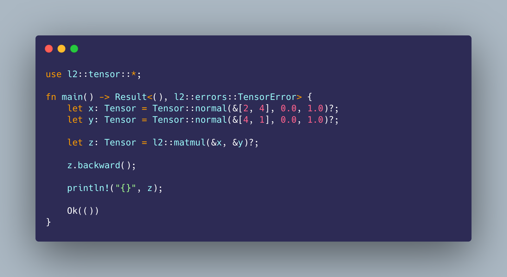

<h1 align='center'>
    L2 • 🤖
</h1>

<h4 align='center'>
    A tensor, linear algebra, and deep learning library in C++, using only the standard library
</h4>

<p align='center'>
    <a href="https://forthebadge.com">
        
    </a>
    <a href="https://github.com/prettier/prettier">
        
    </a>
    <a href="https://opensource.org/licenses/MIT">
        
    </a>
    <a href="http://makeapullrequest.com">
        
    </a>
    <a href="https://github.com/bkkaggle/L2/pulls">
        
    </a>
</p>

<p align='center'>
    <a href='#installation'>Installation</a> •
    <a href='#documentation'>Documentation</a> •
    <a href='#contributing'>Contributing</a> •
    <a href='#authors'>Authors</a> •
    <a href='#license'>License</a>
</p>

<div>
    
</div>

<p align='center'><strong>Made by <a href='https://github.com/bkkaggle'>Bilal Khan</a> • https://bkkaggle.github.io</strong></p>

<!-- START doctoc generated TOC please keep comment here to allow auto update -->
<!-- DON'T EDIT THIS SECTION, INSTEAD RE-RUN doctoc TO UPDATE -->

-   [Quick start](#quick-start)
-   [Installation](#installation)
-   [Documentation](#documentation)
    -   [Tensor](#tensor)
    -   [Parameter](#parameter)
    -   [nn](#nn)
        -   [Linear](#linear)
        -   [Sigmoid](#sigmoid)
        -   [Sequential](#sequential)
    -   [Loss](#loss)
        -   [MSE](#mse)
    -   [Optimizer](#optimizer)
        -   [SGD](#sgd)
    -   [Trainer](#trainer)
-   [Contributing](#contributing)
-   [Authors](#authors)
-   [License](#license)
-   [Acknowledgements](#acknowledgements)

<!-- END doctoc generated TOC please keep comment here to allow auto update -->

# Quick start

// explain what L2 does

```cpp
L2::Tensor<double> x = L2::Tensor<double>({100, 10}).normal(0, 1);

L2::Tensor<double> w = L2::Tensor<double>({10, 1}).normal(0, 1);
L2::Tensor<double> b = L2::Tensor<double>({1}).normal(0, 1);

L2::Tensor<double> y = L2::matmul(x, w) + b;

L2::nn::loss::MSE<double> *criterion = new L2::nn::loss::MSE<double>();
L2::nn::optimizer::SGD<double> *optimizer = new L2::nn::optimizer::SGD<double>(0.05);

L2::nn::Sequential<double> *sequential = new L2::nn::Sequential<double>({
    new L2::nn::Linear<double>(10, 1) //
});

L2::trainer::Trainer<double> trainer = L2::trainer::Trainer<double>(sequential, criterion, optimizer);

trainer.fit(x, y, 10, 10);

L2::Tensor<double> y_hat = trainer.predict(x);

y_hat.print();
```

# design choices

# Installation

-   main.cpp
-   as library

# Documentation

-   public methods
-   example per heading

#### L2

#### [L2::Tensor\<double>({3, 3})](./include/tensor.h#L13)

##### Create a tensor

```cpp
// Create a tensor of zeros with a shape of 3x3
L2::Tensor<double> x = L2::Tensor<double>({3, 3});

// Create a tensor from a vector with a shape of 3x3
std::vector<double> vector{1, 2, 3, 4, 5, 6, 7, 8, 9};
x = L2::Tensor<double>(vector, {3, 3});
```

##### Numpy style array slicing

```cpp
// Get the first row from Tensor x
L2::Tensor<double> y = x({{0, 1}}); // slices (0, 1] and (0, -1]

// Get the first column from Tensor x
L2::Tensor<double> y = x({{0, -1}, (0, 1)}); // slices (0, -1] and (0, 1]

// Get the first two columns and first two rows from Tensor x
L2::Tensor<double> z = x({{0, 2}, {0, 2}}); // slices (0, 2] and (0, 2]
```

##### Change dimensions of a Tensor

```cpp
// Change the shape of a tensor (Strided arrays let you change the user-visible shape without changing the order of the data elements)
L2::Tensor<double> y = x.view({9}); // shape: (9)

// Reshape to -1
L2::Tensor<double> y = x.view({-1}); // shape: (9)

// Add a dimension to a Tensor
// shape: (3, 3)
L2::Tensor<double> y = x.unsqueeze(0); // shape: (1, 3, 3)

// Transpose a Tensor
// shape: (4, 3)
L2::Tensor<double> y = x.transpose(); // shape: (3, 4)
```

##### Get information about a Tensor

```cpp
// Print info about the Tensor to std::cout
>>> x.print();
data:

0, 0, 0, 0, 0, 0, 0, 0, 0,

size:

3, 3,

strides:

3, 1,

dtype:

double
>>>

// Get the shape
std::vector<int> shape = x.get_shape(); // [3, 3]

// Get the data
std::vector<double> data = x.get_data(); // [1, 2, 3, 4, 5, 6, 7, 8, 9]

// Get the number of elements in the Tensor
int length = x.length(); // 9

// Get the type of the Tensor
std::string type = x.type(); // double
```

##### Operations on tensors (with broadcasting!)

```cpp
// Concatenate Tensors
L2::Tensor<double> x = L2::Tensor<double>({3, 3}).zeros();
L2::Tensor<double> y = L2::Tensor<double>({4, 3}).zeros();

L2::Tensor<double> z = L2::cat({x, y}, 0); // shape: (7, 3)

// Add values to all elements in a Tensor
L2::Tensor<double> y = x + 1;

// Inplace operations
x += 2.0;

// exp(), log(), sqrt()
L2::Tensor<double> y = x.log();

// inplace version
x.log_();

// Add a tensor to a tensor
L2::Tensor<double> x = L2::Tensor<double>({3, 3}).normal(0, 1);
L2::Tensor<double> y = L2::Tensor<double>({3}).normal(0, 1);

L2::Tensor<double> z = x + y; // y is added to each column of x

// Sum up all values in a Tensor
L2::Tensor<double> y = x.sum(); // y has a shape of 1

// Sum up all values along a dimension
L2::Tensor<double> y = x.sum(0); // y has a shape of 3
```

##### Initialize a tensor

```cpp
// fill with zeros
L2::Tensor<double> x = L2::Tensor<double>({3, 3}).zeros();

// fill from a normal distribution with a specified mean and stddev
L2::Tensor<double> x = L2::Tensor<double>({3, 3}).normal(0, 1); // mean of 0, stddev of 1

// fill from a uniform distribution with specified limits
L2::Tensor<double> x = L2::Tensor<double>({3, 3}).uniform(-1, 1); // lower bound of -1, upper bound of 1
```

##### Linear algebra functions

```cpp
// matrix multiplication
L2::Tensor<double> x = L2::Tensor<double>({2, 4}).zeros();
L2::Tensor<double> y = L2::Tensor<double>({4, 5}).zeros();

L2::Tensor<double> z = L2::matmul({x, y}); // shape: (2, 5)
```

#### [L2::Parameter\<double>(tensor)](./include/parameter.h#L8)

#### nn

[L2::\<double>()](./include/)

##### [L2::nn::Linear\<double>(c_in=32, c_out=64)](./include/nn.h#L14)

##### [L2::nn::Sigmoid\<double>()](./include/nn.h#L30)

##### [L2::nn::Sequential\<double>(layers)](./include/nn.h#L42)

#### Loss

##### [L2::nn::loss::MSE\<double>()](./include/loss.h#L11)

#### Optimizer

##### [L2::nn::optimizer::SGD\<double>(lr=0.1)](./include/optimizer.h#L42)

#### [L2::nn::trainer::Trainer\<double>(model, criterion, optimizer)](./include/trainer.h#L13)

# Contributing

This repository is still a work in progress, so if you find a bug, think there is something missing, or have any suggestions for new features, feel free to open an issue or a pull request. Feel free to use the library or code from it in your own projects, and if you feel that some code used in this project hasn't been properly accredited, please open an issue.

# Authors

-   _Bilal Khan_ - _Initial work_

# License

This project is licensed under the MIT License - see the [license](LICENSE) file for details

# Acknowledgements

The fast.ai deep learning from the foundations course (https://course.fast.ai/part2) teaches a lot about how to make your own deep learning library

Some of the blog posts I used when writing this library include:

-   http://blog.ezyang.com/2019/05/pytorch-internals/
-   https://pytorch.org/tutorials/beginner/nn_tutorial.html
-   https://eisenjulian.github.io/deep-learning-in-100-lines/
-   https://medium.com/@florian.caesar/how-to-create-a-machine-learning-framework-from-scratch-in-491-steps-93428369a4eb
-   https://medium.com/@johan.mabille/how-we-wrote-xtensor-1-n-n-dimensional-containers-f79f9f4966a7

Other deep learning libraries from scratch include:

-   https://github.com/explosion/thinc
-   https://github.com/joelgrus/joelnet
-   https://github.com/QuantStack/xtensor
-   https://github.com/ThinkingTransistor/Sigma

This README is based on:

-   https://github.com/bkkaggle/pytorch_zoo
-   https://github.com/bkkaggle/grover
-   https://github.com/rish-16/gpt2client
-   https://github.com/mxbi/mlcrate
-   https://github.com/athityakumar/colorls
-   https://github.com/amitmerchant1990/electron-markdownify

I used carbon.now.sh with the "Shades of Purple" theme for the screenshot at the beginning of this README
